# CS-Geni

## About CS-Geni

CS-Geni is a free learning platform for people starting with no computer science background. It uses structured paths, visual explanations, hands-on practice, projects, and progress tracking to help learners move from first principles toward professional skills.

Our mission is to make rigorous computer science education approachable and accessible. This repository is a small interactive showcase of that vision—not the production application or the full curriculum.

## The learning journey

```mermaid
flowchart LR
    A["No CS background"] --> B["Foundations"]
    B --> C["Programming"]
    C --> D["Core CS"]
    D --> E["Systems / Data / Security"]
    E --> F["Projects"]
    F --> G["Professional skills"]

    classDef start fill:#12261b,stroke:#60f28c,color:#f2f4df,stroke-width:2px
    classDef path fill:#10231b,stroke:#ff9654,color:#f2f4df
    classDef goal fill:#60f28c,stroke:#2dde68,color:#07110e,stroke-width:2px
    class A start
    class B,C,D,E,F path
    class G goal
```

Each stage builds on the last. Learners first understand the ideas, then write code, connect concepts, and use them in projects.

## Explore the demo

The public site includes three small, original interactions:

| Demo | Try it | See the idea |
| --- | --- | --- |
| **Values and variables** | Change a name and number | A variable keeps a value under a useful name |
| **Loops** | Step through three robots | A loop repeats one instruction for each item |
| **Stacks** | Push and pop blocks | The last item added is the first item removed |

[Open the interactive demo](https://cs-geni.github.io/public/) or [share an idea](https://github.com/CS-Geni/public/issues).

## What is public here

This repository contains the static showcase, its original visual assets, and lightweight tests. It does **not** contain the production platform, full curriculum, learner data, private services, credentials, or code from private CS-Geni systems.

## Deploy to GitHub Pages

The included Pages workflow deploys the repository as a static site when changes land on `main`.

1. Open the repository’s **Settings → Pages**.
2. Under **Build and deployment**, choose **GitHub Actions** as the source.
3. Push or merge a change to `main`, or run the workflow manually.

The workflow uploads only the public static files required by the demo.

## Contributing

Issues and pull requests that improve clarity, accessibility, visual polish, or the small public demos are welcome. Keep changes focused, beginner-friendly, dependency-light, and suitable for a fully public repository. Run `npm run check` before submitting a pull request.

By contributing, you agree that your contribution may be distributed under the MIT License.

## Privacy and security

**Never submit secrets, credentials, personal learner data, private curriculum, proprietary material, production configuration, or implementation copied from private CS-Geni systems.** Treat every commit, issue, build log, and pull request in this repository as public.

If you believe you found a security issue, do not include sensitive exploit details or real credentials in a public issue. Contact the project maintainers privately through an appropriate organization channel.

## License

Original demo code in this repository is available under the [MIT License](LICENSE).
