# CS-Geni

[Start learning with CS-Geni](https://cs-geni.github.io/public/).

## About CS-Geni

CS-Geni is a free learning platform for people starting with no computer science background. It uses structured paths, visual explanations, hands-on practice, projects, and progress tracking to help learners move from first principles toward professional skills.

Our mission is to make rigorous computer science education approachable and accessible. The live site at [cs-geni.github.io/public](https://cs-geni.github.io/public/) is the learning platform: a static GitHub Pages build of the private `CS-Geni/codebase` repository's `main` branch.

## The learning journey

```mermaid
flowchart LR
    A["No CS background"] --> B["Foundations"]
    B --> C["Programming"]
    C --> D["Core CS"]
    D --> E["Systems / Data / Security"]
    E --> F["Projects"]
    F --> G["Professional skills"]

    classDef start fill:#12261b,stroke:#60f28c,color:#f2f4df,stroke-width:2px
    classDef path fill:#10231b,stroke:#ff9654,color:#f2f4df
    classDef goal fill:#60f28c,stroke:#2dde68,color:#07110e,stroke-width:2px
    class A start
    class B,C,D,E,F path
    class G goal
```

Each stage builds on the last. Learners first understand the ideas, then write code, connect concepts, and use them in projects.

## Explore CS-Geni

[Open the learning platform](https://cs-geni.github.io/public/) to browse courses, lessons, and resources with progress saved in your browser.

The original interactive demo remains available as the [public showcase](https://cs-geni.github.io/public/showcase/).

## What is public here

This repository contains the compiled static learning frontend, the original showcase and its visual assets, and lightweight tests. It does **not** contain private application source, server code, learner data, credentials, or private services.

### How the app is published

The frontend is built from private `CS-Geni/codebase` `main` with `VITE_BASE_PATH=/public/` and `VITE_STATIC_DEPLOYMENT=true`. Only compiled `dist/` output is committed here; no server code, source files, curriculum internals, or secrets are published.

## Contributing

Issues and pull requests that improve clarity, accessibility, visual polish, or the public showcase are welcome. Keep changes focused, beginner-friendly, and suitable for a fully public repository. Run `npm run check` before submitting a pull request.

## Privacy and security

Never submit secrets, credentials, personal learner data, private curriculum, proprietary material, production configuration, or implementation copied from private CS-Geni systems. Treat every commit, issue, build log, and pull request in this repository as public.

## License

Original demo code in this repository is available under the [MIT License](LICENSE).
