# CS-Geni

CS-Geni is a free learning platform for people starting with no computer science background. It uses structured paths, visual explanations, hands-on practice, projects, and progress tracking to help learners move from first principles toward professional skills.

Our mission is to make rigorous computer science education approachable and accessible. This repository is a small interactive showcase of that vision—not the production application or the full curriculum.

**[Start learning](https://cs-geni.github.io/public/learn/)** — explore the free course catalog, lessons, and browser-local progress tracking.

## The learning journey

```mermaid
flowchart LR
    A["No CS background"] --> B["Foundations"]
    B --> C["Programming"]
    C --> D["Core CS"]
    D --> E["Systems / Data / Security"]
    E --> F["Projects"]
    F --> G["Professional skills"]

    classDef start fill:#12261b,stroke:#60f28c,color:#f2f4df,stroke-width:2px
    classDef path fill:#10231b,stroke:#ff9654,color:#f2f4df
    classDef goal fill:#60f28c,stroke:#2dde68,color:#07110e,stroke-width:2px
    class A start
    class B,C,D,E,F path
    class G goal
```

## License

Original demo code in this repository is available under the [MIT License](LICENSE).
